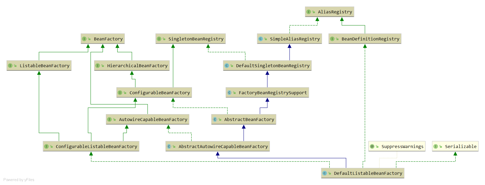

DefaultListableBeanFactory
--------------------------
类层次结构图

- AliasRegistry：定义对alias的简单增删改操作
- SimpleAliasRegistry：使用map作为alias的缓存，并对接口AliasRegistry进行实现
- SingletonBeanRegistry：定义对单列的注册及获取
- BeanFactory：定义获取bean及bean的各种属性
- DefaultSingletonBeanRegistry：对接口SingletonBeanRegistry各函数的实现
- HierarchicalBeanFactory：继承BeanFactory，在BeanFactory定义的功能基础上增加了对parentFactory的支持
- BeanDefinitionRegistry：对BeanDefinition的增删改操作
- FactoryBeanRegistrySupport：在DefaultSingletonBeanRegistry基础上增加对FactoryBean处理
- ConfigurableBeanFactory：提供配置Factory的各种方法
- ListableBeanFactory：提供各种条件获取bean的配置清单
- AbstractBeanFactory：综合FactoryBeanRegistrySupport和ConfigurableBeanFactory的功能
- AutowireCapableBeanFactory：提供创建bean、自动注入、初始化以及应用bean的后处理器
- AbstractAutowireCapableBeanFactory：综合AbstractBeanFactory并对接口AutowireCapableBeanFactory实现
- ConfigurableListableBeanFactory：BeanFactory配置清单，指定忽略类型及接口等
- DefaultListableBeanFactory：综合上面所有功能，主要是对bean注册后的处理

------------------------

AbstractBeanDefinition
------------------------

```
public abstract class AbstractBeanDefinition{
    省略......
	//bean作用范围，bean的属性scope
	@Nullable
	private String scope = SCOPE_DEFAULT;

	//是否是抽象，bean的属性
	private boolean abstractFlag = false;

	//是否延迟加载
	@Nullable
	private Boolean lazyInit;

	//自动注入模式
	private int autowireMode = AUTOWIRE_NO;

	private int dependencyCheck = DEPENDENCY_CHECK_NONE;

	//表示一个bean的实例化依靠另一个bean先实例化
	@Nullable
	private String[] dependsOn;

	//false，容器在查找自动装配对象时，将不考虑该bean，即不会作为其他bean自动装配的候选者
	//但该bean本身可以使用自动装配注入其他bean
	private boolean autowireCandidate = true;

	//自动装配出现多个bean候选者时，将作为首选者
	private boolean primary = false;

	//记录Qualifier，对应子元素qualifier
	private final Map<String, AutowireCandidateQualifier> qualifiers = new LinkedHashMap<>();

	@Nullable
	private Supplier<?> instanceSupplier;

	//允许访问非公开的构造器和方法
	private boolean nonPublicAccessAllowed = true;

	//是否以宽松的模式解析构造函数，默认true
	//如果false，存在一下情况
	//	interface ITest{}
	//	class ITestImpl extend ITest{}
	//	Class Test{
	//	 main(ITest i){}
	//	 main(ITestImpl i){}
	//	}
	//抛出异常，spring无法准确定位构造函数
	private boolean lenientConstructorResolution = true;

	@Nullable
	private String factoryBeanName;

	@Nullable
	private String factoryMethodName;

	//记录构造函数注入属性，对应bean属性的constructor-arg
	@Nullable
	private ConstructorArgumentValues constructorArgumentValues;

	//普通属性集合
	@Nullable
	private MutablePropertyValues propertyValues;

	//方法重写持有者，记录look-method、replace-method
	private MethodOverrides methodOverrides = new MethodOverrides();

	@Nullable
	private String initMethodName;

	@Nullable
	private String destroyMethodName;

	private boolean enforceInitMethod = true;

	private boolean enforceDestroyMethod = true;

	//是否是用户定义的而不是应用程序本身定义的，创建aop时为true，程序设置
	private boolean synthetic = false;

	//APPLICATION 用户，INFRASTRUCTURE 内部使用，与用户无关，SUPPORT 某些复杂配置的一部分
	private int role = BeanDefinition.ROLE_APPLICATION;

	@Nullable
	private String description;

	@Nullable
	private Resource resource;
}
```
