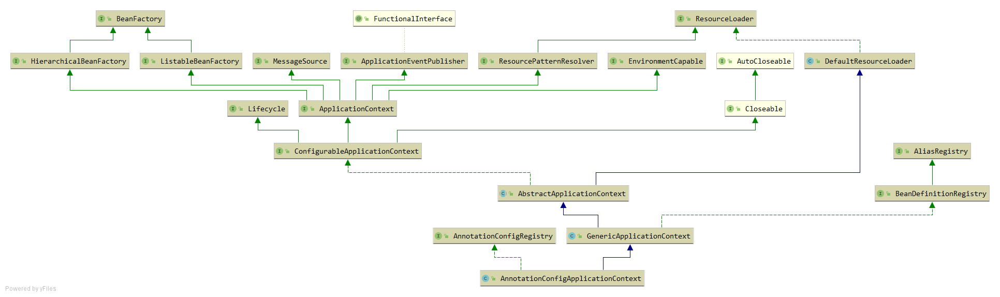

AnnotationConfigApplicationContext
------------------------------

主要内容：

使用 `AnnotationConfigApplicationContext`，通过在 `@Configuartion` 注解添加一个配置类，
从配置类中的注解`@ComponentScan`以及`@Bean`方法，将bean加载到 `BeanFactory`注册表 `beanDefinitionMap` 的详细过程。
使用AnnotationConfigApplicationContext可以更好理解SpringBoot的加载过程。

`AnnotationConfigApplicationContext` 的继承体系结构图：



`AnnotationConfigApplicationContext` 继承自 `GenericApplicationContext`，而
`GenericApplicationContext` 是 `AbstractApplicationContext`
的子类，使用的类注册工厂是`DefaultListableBeanFactory`。

**简单来说，`DefaultListableBeanFactory` 是 `Spring` 注册及加载 `bean`
的默认实现，它会将注册的 `bean`放入 `beanDefinitionMap` 进行 `key-value`
形式存储。**

`ResourceLoader`是它的顶层接口，表示这个类实现了资源加载功能。

构造器的代码：

``` java
	public AnnotationConfigApplicationContext(Class<?>... componentClasses) {
		this();	//初始化扫描bean的工具类，以及注册后置处理器
		register(componentClasses);	//注册配置类
		refresh();	//刷新应用上下文
	}
```

------------------------------------------------------------------------


### 设置注解解析器
this()

> org.springframework.context.annotation.AnnotationConfigApplicationContext

创建AnnotationConfigApplicationContext并填充需要注册回调和手动刷新，同时会依次调用父类的构造器
-   DefaultResourceLoader 初始化classloader， 即为当前线程的classloader
-   AbstractApplicationContext 初始化资源模式解析器PathMatchingResourcePatternResolver，如解析classpath*:、web/*.xml等
-   GenericApplicationContext 声明Bean工厂DefaultListableBeanFactory
-   AnnotationConfigApplicationContext 初始化AnnotatedBeanDefinitionReader、 ClassPathBeanDefinitionScanner解析注册的Bean对象
``` java
public AnnotationConfigApplicationContext() {
	// 编程注解的bean对象适配器
	this.reader = new AnnotatedBeanDefinitionReader(this);
	// bean扫描器，在classpath下解析被Component、Repository、Service、Controller等注解标识的类
	this.scanner = new ClassPathBeanDefinitionScanner(this);
}
```
AnnotatedBeanDefinitionReader用于注册处理配置Bean的处理器，并提供处理Bean的方法
-   getOrCreateEnvironment 将会创建Environment对象，用于处理系统和jvm环境参数、命令参数、properties资源

``` java
public AnnotatedBeanDefinitionReader(BeanDefinitionRegistry registry) {
	this(registry, getOrCreateEnvironment(registry));
}

public AnnotatedBeanDefinitionReader(BeanDefinitionRegistry registry, Environment environment) {
    ......
	AnnotationConfigUtils.registerAnnotationConfigProcessors(this.registry);
}
```
AnnotationConfigUtils.registerAnnotationConfigProcessors(this.registry)注册配置后置处理器
``` java
public static Set<BeanDefinitionHolder> registerAnnotationConfigProcessors(
	    BeanDefinitionRegistry registry, @Nullable Object source) {
	// 对Aware接口实现类的顺序进行排序
	beanFactory.setDependencyComparator(AnnotationAwareOrderComparator.INSTANCE);
	// 对注解的支持，包括指定的注解和懒加载注解
	beanFactory.setAutowireCandidateResolver(new ContextAnnotationAutowireCandidateResolver());
    // 处理配置注解后置处理器，如@Configuration注解或者<context:annotation-config/> 和 <context:component-scan/>
	RootBeanDefinition def = new RootBeanDefinition(ConfigurationClassPostProcessor.class);
	beanDefs.add(registerPostProcessor(registry, def, CONFIGURATION_ANNOTATION_PROCESSOR_BEAN_NAME));
    // 处理@Autowired、@Value注解
	RootBeanDefinition def = new RootBeanDefinition(AutowiredAnnotationBeanPostProcessor.class);
	beanDefs.add(registerPostProcessor(registry, def, AUTOWIRED_ANNOTATION_PROCESSOR_BEAN_NAME));
    //支持javax.annotation下的的注解，如@PostConstruct、@PreDestroy
	RootBeanDefinition def = new RootBeanDefinition(CommonAnnotationBeanPostProcessor.class);
	beanDefs.add(registerPostProcessor(registry, def, COMMON_ANNOTATION_PROCESSOR_BEAN_NAME));
    // 添加持久化注解后置处理器
	RootBeanDefinition def = new RootBeanDefinition();
		def.setBeanClass(ClassUtils.forName(PERSISTENCE_ANNOTATION_PROCESSOR_CLASS_NAME,
				AnnotationConfigUtils.class.getClassLoader()));
	beanDefs.add(registerPostProcessor(registry, def, PERSISTENCE_ANNOTATION_PROCESSOR_BEAN_NAME));
	// 事件监听处理
	RootBeanDefinition def = new RootBeanDefinition(EventListenerMethodProcessor.class);
	beanDefs.add(registerPostProcessor(registry, def, EVENT_LISTENER_PROCESSOR_BEAN_NAME));
	// 默认的事件监听工厂
	RootBeanDefinition def = new RootBeanDefinition(DefaultEventListenerFactory.class);
	beanDefs.add(registerPostProcessor(registry, def, EVENT_LISTENER_FACTORY_BEAN_NAME));
}
```
ClassPathBeanDefinitionScanner(BeanDefinitionRegistry registry)加载元数据
``` java
public ClassPathBeanDefinitionScanner(BeanDefinitionRegistry registry, boolean useDefaultFilters,
		Environment environment, @Nullable ResourceLoader resourceLoader) {

	Assert.notNull(registry, "BeanDefinitionRegistry must not be null");
	this.registry = registry;

	if (useDefaultFilters) {
		// 为@Component注册默认的过滤器，Component包含Repository、Service、Controller
		registerDefaultFilters();
	}
	setEnvironment(environment);
	setResourceLoader(resourceLoader);
}
```

----------------

注册配置类
------
register(componentClasses)

``` java
public void register(Class<?>... componentClasses) {
	this.reader.register(componentClasses);
}

private <T> void doRegisterBean(Class<T> beanClass, @Nullable String name,
    //注册该配置类到BeanFactory
	BeanDefinitionReaderUtils.registerBeanDefinition(definitionHolder, this.registry);
}

```

Bean 的解析和注册
-----------------
refresh()

> AbstractApplicationContext.refresh()

``` java
public void refresh() throws BeansException, IllegalStateException {
	synchronized (this.startupShutdownMonitor) {
		// 为刷新准备上下文
		prepareRefresh();

		// 由子类实现逻辑
		ConfigurableListableBeanFactory beanFactory = obtainFreshBeanFactory();

		prepareBeanFactory(beanFactory);

		try {
			// Allows post-processing of the bean factory in context subclasses.
			postProcessBeanFactory(beanFactory);

			// Invoke factory processors registered as beans in the context.
			// 调用BeanFactory后置处理器
			invokeBeanFactoryPostProcessors(beanFactory);

			// Register bean processors that intercept bean creation.
			// 注册Bean后置处理器
			registerBeanPostProcessors(beanFactory);

			// Initialize message source for this context.
			initMessageSource();

			// Initialize event multicaster for this context.
			initApplicationEventMulticaster();

			// Initialize other special beans in specific context subclasses.
			onRefresh();

			// Check for listener beans and register them.
			registerListeners();

			// Instantiate all remaining (non-lazy-init) singletons.
			finishBeanFactoryInitialization(beanFactory);

			// Last step: publish corresponding event.
			finishRefresh();
		}

		catch (BeansException ex) {
			if (logger.isWarnEnabled()) {
				logger.warn("Exception encountered during context initialization - " +
						"cancelling refresh attempt: " + ex);
			}

			// Destroy already created singletons to avoid dangling resources.
			destroyBeans();

			// Reset 'active' flag.
			cancelRefresh(ex);

			// Propagate exception to caller.
			throw ex;
		}

		finally {
			// Reset common introspection caches in Spring's core, since we
			// might not ever need metadata for singleton beans anymore...
			resetCommonCaches();
		}
	}
}
```

------------------------------------------------------------------------

### 获取 `bean` 容器

在这行代码中
`ConfigurableListableBeanFactory beanFactory = obtainFreshBeanFactory();`

具体调用的是 :

> org.springframework.context.support.GenericApplicationContext\#refreshBeanFactory

``` java
protected ConfigurableListableBeanFactory obtainFreshBeanFactory() {
	refreshBeanFactory();
	return getBeanFactory();
}
```

在AnnotationConfigApplicationContext中注解返回，在AbstractRefreshableApplicationContext
在这一步新建了 `bean` 容器和解析 `bean`，并将 `bean`注册到容器中。

------------------------------------------------------------------------

### prepareBeanFactory

准备类加载器的环境，对前面获取到的
`beanFactory(ConfigurationListableBeanFactory)` 进行相关的设置，包括
`ClassLoader`, `post-processors`等

------------------------------------------------------------------------

#### invokeBeanFactoryPostProcessors

实例化并调用所有注册的`BeanFactoryPostProcessorBean`后处理器，处理类型是`BeanFactory`, `Spring` 容器允许在实例化 `bean` 前，
读取 `bean`信息和修改它的属性。依据这些处理器是否实现 `PriorityOrdered`、`Order` 接口，根据 `order` 值进行排序。

相当于在实例化前，给用户最后一次机会去修改 `bean` 信息。
``` java
public static void invokeBeanFactoryPostProcessors(
		ConfigurableListableBeanFactory beanFactory, List<BeanFactoryPostProcessor> beanFactoryPostProcessors) {
	if (beanFactory instanceof BeanDefinitionRegistry) {
        ......
		// 此时会获取AnnotationConfigApplicationContext注册的ConfigurationClassPostProcessor，用于加载配置类的Bean定义
		// 处理BeanDefinitionRegistryPostProcessor接口的实现类，并在getBean获取该实例初始化该processor
        // 调用接口的postProcessBeanDefinitionRegistry方法
		String[] postProcessorNames =
				beanFactory.getBeanNamesForType(BeanDefinitionRegistryPostProcessor.class, true, false);
		for (String ppName : postProcessorNames) {
			if (beanFactory.isTypeMatch(ppName, PriorityOrdered.class)) {
				// getBean时实例化BeanDefinitionRegistryPostProcessor接口的实现类
				currentRegistryProcessors.add(beanFactory.getBean(ppName, BeanDefinitionRegistryPostProcessor.class));
				processedBeans.add(ppName);
			}
		}
		// 执行processor的方法，执行Bean定义注册方法
		invokeBeanDefinitionRegistryPostProcessors(currentRegistryProcessors, registry);

		// 处理实现Ordered接口的类，此时会加载上一步ConfigurationClassPostProcessor解析的Bean
		postProcessorNames = beanFactory.getBeanNamesForType(BeanDefinitionRegistryPostProcessor.class, true, false);
		for (String ppName : postProcessorNames) {
			if (!processedBeans.contains(ppName) && beanFactory.isTypeMatch(ppName, Ordered.class)) {
				currentRegistryProcessors.add(beanFactory.getBean(ppName, BeanDefinitionRegistryPostProcessor.class));
				processedBeans.add(ppName);
			}
		}
		invokeBeanDefinitionRegistryPostProcessors(currentRegistryProcessors, registry);
        // 处理剩下的接口
		postProcessorNames = beanFactory.getBeanNamesForType(BeanDefinitionRegistryPostProcessor.class, true, false);
		for (String ppName : postProcessorNames) {
			if (!processedBeans.contains(ppName)) {
				currentRegistryProcessors.add(beanFactory.getBean(ppName, BeanDefinitionRegistryPostProcessor.class));
				processedBeans.add(ppName);
			}
		}
		invokeBeanDefinitionRegistryPostProcessors(currentRegistryProcessors, registry);

		// 调用 postProcessBeanFactory 方法
		//在标准初始化之后修改应用程序上下文的内部bean工厂。所有bean定义都将被加载，但是还没有bean被实例化。
		// 这允许重写或添加属性，甚至可以对bean进行初始化
		invokeBeanFactoryPostProcessors(registryProcessors, beanFactory);
		invokeBeanFactoryPostProcessors(regularPostProcessors, beanFactory);
	}

	//不要在这里初始化factory beans：我们需要让所有常规bean都未初始化，以便让bean工厂后处理器应用于它们！
	String[] postProcessorNames =
			beanFactory.getBeanNamesForType(BeanFactoryPostProcessor.class, true, false);
	List<BeanFactoryPostProcessor> priorityOrderedPostProcessors = new ArrayList<>();
	List<String> orderedPostProcessorNames = new ArrayList<>();
	List<String> nonOrderedPostProcessorNames = new ArrayList<>();
	for (String ppName : postProcessorNames) {
		if (processedBeans.contains(ppName)) {
			// skip - already processed in first phase above
		}
		else if (beanFactory.isTypeMatch(ppName, PriorityOrdered.class)) {
			//getBean时实力化BeanFactoryPostProcessor接口的实现类
			priorityOrderedPostProcessors.add(beanFactory.getBean(ppName, BeanFactoryPostProcessor.class));
		}
		else if (beanFactory.isTypeMatch(ppName, Ordered.class)) {
			orderedPostProcessorNames.add(ppName);
		}
		else {
			nonOrderedPostProcessorNames.add(ppName);
		}
	}

	invokeBeanFactoryPostProcessors(priorityOrderedPostProcessors, beanFactory);
    ......
}
```
-----------------------------
#### registerBeanPostProcessors

注册BeanPostProcessor处理器，在bean实例化前后进行调用
``` java
public static void registerBeanPostProcessors(
		ConfigurableListableBeanFactory beanFactory, AbstractApplicationContext applicationContext) {

	String[] postProcessorNames = beanFactory.getBeanNamesForType(BeanPostProcessor.class, true, false);

	......
	registerBeanPostProcessors(beanFactory, nonOrderedPostProcessors);
    ......
}
```

------------------------------------------------------------------------

#### initMessageSource

初始化此上下文的消息源

------------------------------------------------------------------------

#### onRefresh

模板方法，可被重写以添加特定于上下文的刷新工作。在实例化单例之前调用特殊 `bean` 的初始化。

-------------------------------------------------------------------
### registerListeners

注册监听器

------------------------------------------------------------------------

#### finishBeanFactoryInitialization

完成 `bean` 容器的初始化，实例化所有剩余的(非惰性初始化)单例

------------------------------------------------------------------------

#### finishRefresh

推送应用通信的事件

------------------------------------------------------------------------

#### resetCommonCaches

最后一步清除缓存，重置 `Spring` 核心中的公共内省缓存，因为可能再也不需要单例 `bean`的元数据了


------------------------------------------------------------------------