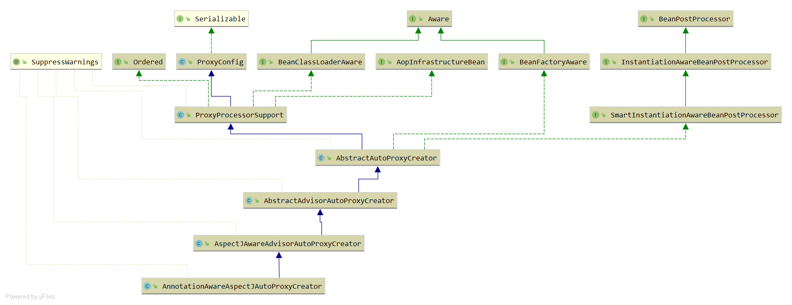
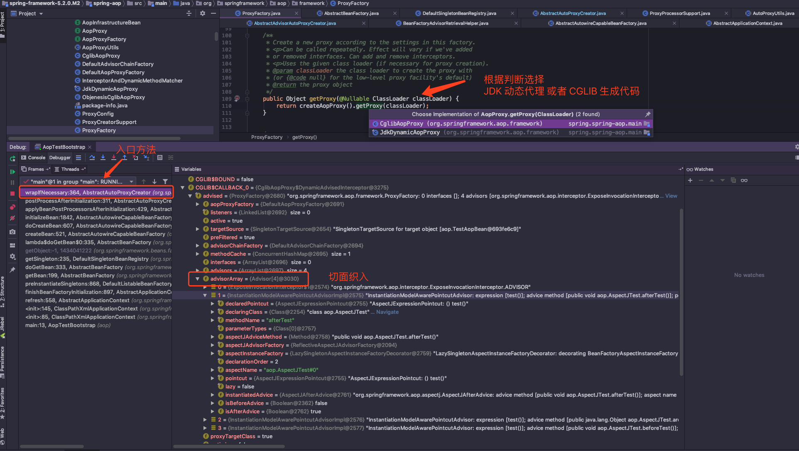
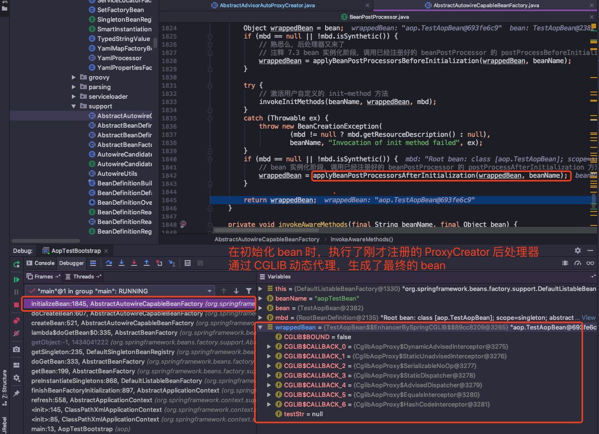

## spring aop 使用

创建用于拦截的 bean

```java
@Component
public class AopComponent {
	public void aopMethod(){
		System.out.println("aop method run ");
	}
}
```
创建 Advisor

```java
@Aspect
@Component
public class SpringAspect {

	@Pointcut("execution(* spring.context.annotation.component.AopComponent.*(..))")
	public void aop(){

	}

	@Before("aop()")
	public void beforeMethod(){
		System.out.println("before aop");
	}

	@Around("aop()")
	public Object aroundAop(ProceedingJoinPoint joinPoint){
		System.out.println("before around");
		Object o=null;
		try {
			o = joinPoint.proceed();
		}catch(Throwable e){
			e.printStackTrace();
		}
		System.out.println("after around");
		return o;
	}

	@After("aop()")
	public void afterMethod(){
		System.out.println("after aop");
	}

}
```
`@Aspect` 注解让 `Spring` 认识到这个是一个切面 `bean`，在方法打上 `@Pointcut("execution(* spring.context.annotation.component.AopComponent.*(..))")`，
表示这是一个切点方法，`execution()` 内部的表达式指明被拦截的方法，`Before` 、`After`、`Around` 分别表示在被拦截方法的前、后已经环绕执行。

启用spring aop

```java
@Configuration
@EnableAspectJAutoProxy
@ComponentScan(basePackages = {
		"spring.context.annotation.processor",
		"spring.context.annotation.component",
		"spring.context.annotation.aop"
})
public class ScanConfig {
}
```
EnableAspectJAutoProxy注解启用spring aop 切面编程

测试
```java
public class SpringAnnotationContext {
	public static void main(String[] args) {
		AnnotationConfigApplicationContext context
				= new AnnotationConfigApplicationContext(BeanConfig.class, PropertiesConfig.class, ScanConfig.class, ImportConfig.class);
		AopComponent aopComponent = context.getBean(AopComponent.class);
		aopComponent.aopMethod();
        //before around
        //before aop
        //aop method run 
        //after around
        //after aop
	}
}
```

根据上面的启动例子，发现在自己写的核心业务方法 `testAop()` 上，明明只是简单打印了 `I am the true aop bean`，但执行结果输出了其它内容，**说明这个类被增强了，在不修改核心业务方法上，我们对它进行了扩展。证明了  AOP 可以使辅助功能独立于核心业务之外，方便了程序的扩展和解耦。**

使用起来很方便，接下来一起来看看 `Spring` 是如何实现 `AOP` 功能的吧~

---
# EnableAspectJAutoProxy

```java
@Target(ElementType.TYPE)
@Retention(RetentionPolicy.RUNTIME)
@Documented
@Import(AspectJAutoProxyRegistrar.class)
public @interface EnableAspectJAutoProxy {
    // jdk 动态代理 或 cglib，默认为false即jdk代理
	boolean proxyTargetClass() default false;

	// 扩展增强，有时候目标对象内部的自我调用无法实施切面中的增强，通过这个属性可以同时对两个方法进行增强
	boolean exposeProxy() default false;

}

```
---
## @Import(AspectJAutoProxyRegistrar.class)

注册aop配置类

```java
class AspectJAutoProxyRegistrar implements ImportBeanDefinitionRegistrar {

	@Override
	public void registerBeanDefinitions(
			AnnotationMetadata importingClassMetadata, BeanDefinitionRegistry registry) {
		AopConfigUtils.registerAspectJAnnotationAutoProxyCreatorIfNecessary(registry);
		AnnotationAttributes enableAspectJAutoProxy =
				AnnotationConfigUtils.attributesFor(importingClassMetadata, EnableAspectJAutoProxy.class);
		if (enableAspectJAutoProxy != null) {
			if (enableAspectJAutoProxy.getBoolean("proxyTargetClass")) {
				AopConfigUtils.forceAutoProxyCreatorToUseClassProxying(registry);
			}
			if (enableAspectJAutoProxy.getBoolean("exposeProxy")) {
				AopConfigUtils.forceAutoProxyCreatorToExposeProxy(registry);
			}
		}
	}

}
```
主要完成注册 `AnnotationAwareAspectJAutoProxyCreator`，是否使用cglib


 `AOP` 的实现，基本上都是靠 `AnnotationAwareAspectJAutoProxyCreator` 去完成，它可以根据 `@Point` 注解定义的切点来自动代理相匹配的 `bean`。

`Spring` 是如何使用自定义配置来帮助我们自动注册 `AnnotationAwareAspectJAutoProxyCreator`。**


``` java

public static BeanDefinition registerAspectJAnnotationAutoProxyCreatorIfNecessary(
		BeanDefinitionRegistry registry, @Nullable Object source) {
	// 实际注册的 bean 类型是 AnnotationAwareAspectJAutoProxyCreator
	return registerOrEscalateApcAsRequired(AnnotationAwareAspectJAutoProxyCreator.class, registry, source);
}

@Nullable
private static BeanDefinition registerOrEscalateApcAsRequired(
		Class<?> cls, BeanDefinitionRegistry registry, @Nullable Object source) {

	Assert.notNull(registry, "BeanDefinitionRegistry must not be null");

	if (registry.containsBeanDefinition(AUTO_PROXY_CREATOR_BEAN_NAME)) {
		// 如果在 registry 已经存在自动代理创建器，并且传入的代理器类型与注册的不一致，根据优先级判断是否需要修改
		BeanDefinition apcDefinition = registry.getBeanDefinition(AUTO_PROXY_CREATOR_BEAN_NAME);
		if (!cls.getName().equals(apcDefinition.getBeanClassName())) {
			int currentPriority = findPriorityForClass(apcDefinition.getBeanClassName());
			int requiredPriority = findPriorityForClass(cls);
			if (currentPriority < requiredPriority) {
				apcDefinition.setBeanClassName(cls.getName());
			}
		}
		return null;
	}
	RootBeanDefinition beanDefinition = new RootBeanDefinition(cls);
	beanDefinition.setSource(source);
	// 默认的是最高优先级
	beanDefinition.getPropertyValues().add("order", Ordered.HIGHEST_PRECEDENCE);
	beanDefinition.setRole(BeanDefinition.ROLE_INFRASTRUCTURE);
	registry.registerBeanDefinition(AUTO_PROXY_CREATOR_BEAN_NAME, beanDefinition);
	return beanDefinition;
}
```
这个步骤中，实现了自动注册 `AnnotationAwareAspectJAutoProxyCreator` 类，同时能看到涉及到优先级的概念和注册名一直都是 `AUTO_PROXY_CREATOR_BEAN_NAME`。

---
### proxy-target-class

`Spring AOP` 部分使用 `JDK` 动态代理 （Proxy + InvocationHandler），或者 `CGLIB` （Code Generation LIB）来为目标对象创建代理。

如果被代理的目标对象**实现了至少一个接口，则会使用 `JDK` 动态代理**。所有该目标类型实现的接口都将被代理。

若该目标对象**没有实现任何接口，则创建一个 `CGLIB` 代理。**如果希望代理目标对象的所有方法，而不只是实现自接口的方法，可以通过该属性 `proxy-target-class` 开启强制使用 `CGLIB` 代理。

但是强制开启 `CGLIB` 会有以下两个问题：

- **无法同时（advise）Final 方法，因为不能被覆写**
- **需要将 CGLIB 二进制发行包放在 classpath 下面**

强制开启 `CGLIB` 代理：
```
@EnableAspectJAutoProxy(proxyTargetClass = true)
```
---
### expose-proxy

有时候目标对象内部的自我调用将无法实施切面中的增强。

例如两个方法都加上了事务注解 `@Transactional` 但是事务类型不一样：

```java
public interface TestService {
	void a();
	void b();
}

public class TestServiceImpl implements TestService {

	@Override
	@Transactional(propagation = Propagation.REQUIRED)
	public void a() {
		this.b();
	}

	@Override
	@Transactional(propagation = Propagation.REQUIRES_NEW)
	public void b() {
		System.out.println("Hello world");
	}
}
```

此处的 `this` 指向了目标对象， **`this.b()` 方法将不会执行 `b` 事务的切面，即不会执行事务增强。**

为了解决这个问题，使 `a()` 和 `b()` 方法同时增强，可以通过 `expose-proxy` 来实现：

``` 
@EnableAspectJAutoProxy(proxyTargetClass = true,exposeProxy = true)
```

---
## 创建 AOP 代理

 `AnnotationAwareAspectJAutoProxyCreator` 的继承体系：



实现了 `BeanPostProcessor` 接口，它是一个后处理器，可以在 `bean` 实例化前后进行扩展。该接口的两个方法，`postProcessBeforeInitialization` 没有做处理，直接返回该对象。

**实际进行处理的是 `postProcessAfterInitialization` 方法，在 `bean` 实例化之后的处理，在这一步中进行里代理增强，所以来看下这个方法：**

```
	
public Object postProcessAfterInitialization(@Nullable Object bean, String beanName) {
	if (bean != null) {
		// 组装 key
		Object cacheKey = getCacheKey(bean.getClass(), beanName);
		if (this.earlyProxyReferences.remove(cacheKey) != bean) {
			// 如果适合被代理，则需要封装指定的 bean
			return wrapIfNecessary(bean, beanName, cacheKey);
		}
	}
	return bean;
}

protected Object wrapIfNecessary(Object bean, String beanName, Object cacheKey) {
	// 如果已经处理过
	if (StringUtils.hasLength(beanName) && this.targetSourcedBeans.contains(beanName)) {
		return bean;
	}
	// 不需增强
	if (Boolean.FALSE.equals(this.advisedBeans.get(cacheKey))) {
		return bean;
	}
	// 给定的 bean 类是否代表一个基础设施类，基础设置类不应代理 || 配置了指定 bean 不需要代理
	if (isInfrastructureClass(bean.getClass()) || shouldSkip(bean.getClass(), beanName)) {
		this.advisedBeans.put(cacheKey, Boolean.FALSE);
		return bean;
	}
	// 如果存在增强方法则创建代理
	Object[] specificInterceptors = getAdvicesAndAdvisorsForBean(bean.getClass(), beanName, null);
	if (specificInterceptors != DO_NOT_PROXY) {
		// 增强方法不为空
		this.advisedBeans.put(cacheKey, Boolean.TRUE);
		// 创建代理
		Object proxy = createProxy(bean.getClass(), beanName, specificInterceptors, new SingletonTargetSource(bean));
		this.proxyTypes.put(cacheKey, proxy.getClass());
		return proxy;
	}
	this.advisedBeans.put(cacheKey, Boolean.FALSE);
	return bean;
}
```


**来提取一下核心流程：**

1. **获取增强方法或者增强器**
`@Before` 、`@After` 之类的，就是增强方法，`AOP` 处理时，要先找出这些增强方法。
2. **根据获取的增强进行代理**
找到增强方法后，需要对这些增强方法进行增强代理，实际上这个 `bean` 已经不完全是原来的类型了，会变成代理后的类型。

---
## 获取增强方法或者增强器

入口方法在这里：

```
protected Object[] getAdvicesAndAdvisorsForBean(
		Class<?> beanClass, String beanName, @Nullable TargetSource targetSource) {
	// 寻找符合的切面
	List<Advisor> advisors = findEligibleAdvisors(beanClass, beanName);
	if (advisors.isEmpty()) {
		return DO_NOT_PROXY;
	}
	return advisors.toArray();
}

protected List<Advisor> findEligibleAdvisors(Class<?> beanClass, String beanName) {
	// 从 beanFactory 中获取声明为 AspectJ 注解的类，对并这些类进行增强器的提取
	// 委派给子类实现 org.springframework.aop.aspectj.autoproxy.AspectJAwareAdvisorAutoProxyCreator.extendAdvisors
	List<Advisor> candidateAdvisors = findCandidateAdvisors();
	// 寻找匹配的增强器
	List<Advisor> eligibleAdvisors = findAdvisorsThatCanApply(candidateAdvisors, beanClass, beanName);
	extendAdvisors(eligibleAdvisors);
	if (!eligibleAdvisors.isEmpty()) {
		eligibleAdvisors = sortAdvisors(eligibleAdvisors);
	}
	return eligibleAdvisors;
}
```

对于指定 `bean` 的增强方法的获取包含这两个步骤，获取所有的增强以及寻找所有增强中适用于 `bean` 的增强并应用。对应于 `findCandidateAdvisors` 和 `findAdvisorsThatCanApply` 这两个方法。如果没找到对应的增强器，那就返回 `DO_NOT_PROXY` ，表示不需要进行增强。

由于逻辑太多，所以接下来贴的代码不会太多，主要来了解它的大致流程，有需要的可以跟着源码工程的注释跟踪完整的流程~：

---
### 寻找对应的增强器 findCandidateAdvisors

```java
protected List<Advisor> findCandidateAdvisors() {
	List<Advisor> advisors = super.findCandidateAdvisors();
	if (this.aspectJAdvisorsBuilder != null) {
		// 注释 8.3 实际调用的是 org.springframework.aop.aspectj.annotation.BeanFactoryAspectJAdvisorsBuilder.buildAspectJAdvisors
		advisors.addAll(this.aspectJAdvisorsBuilder.buildAspectJAdvisors());
	}
	return advisors;
}
```

实际来看，关键是这个方法 `this.aspectJAdvisorsBuilder.buildAspectJAdvisors()` 这个方法看起来简单，但是实际处理的逻辑很多，代码深度也很多，所以为了避免太多代码，我**罗列了主要流程，和关键的处理方法做了什么**

主要流程如下：

1. **获取所有 beanName，会将之前在 beanFactory 中注册的 bean 都提取出来。**
2. **遍历前一步骤提取出来的 bean 列表，找出打上 @AspectJ 注解的类，进行进一步处理**
3. **继续对前一步提取的 @AspectJ 注解的类进行增强器的提取**
4. **将提取结果加入缓存中**

可以查询代码中的注释，**从 [注释 8.3] 到 [注释 8.8 根据切点信息生成增强器] 都是这个方法的处理逻辑**

※※**在这个流程的最后一步中，会将识别到的切点信息（PointCut）和增强方法(Advice)进行封装，具体是由 `Advisor` 的实现类 `InstantiationModelAwarePointcutAdvisorImpl` 进行统一封装。**

```java
public InstantiationModelAwarePointcutAdvisorImpl(AspectJExpressionPointcut declaredPointcut, Method aspectJAdviceMethod, AspectJAdvisorFactory aspectJAdvisorFactory, MetadataAwareAspectInstanceFactory aspectInstanceFactory, int declarationOrder, String aspectName) {
	// 简单赋值
	this.declaredPointcut = declaredPointcut;
    ...

	if (aspectInstanceFactory.getAspectMetadata().isLazilyInstantiated()) {
		Pointcut preInstantiationPointcut = Pointcuts.union(aspectInstanceFactory.getAspectMetadata().getPerClausePointcut(), this.declaredPointcut);
		this.pointcut = new PerTargetInstantiationModelPointcut(
		this.declaredPointcut, preInstantiationPointcut, aspectInstanceFactory);
		this.lazy = true;
	}
	else {
		// A singleton aspect.
		this.pointcut = this.declaredPointcut;
		this.lazy = false;
		// 初始化增强器
		this.instantiatedAdvice = instantiateAdvice(this.declaredPointcut);
	}
}
```

封装体前半部分逻辑只是简单赋值。关键是这个方法 `instantiateAdvice(this.declaredPointcut)`，在这一步中，对不同的增强（Before/After/Around）实现的逻辑是不一样的。在 `ReflectiveAspectJAdvisorFactory#getAdvice` 方法中区别实现了根据不同的注解类型封装不同的增强器。

```java
public Advice getAdvice(Method candidateAdviceMethod, AspectJExpressionPointcut expressionPointcut,
			MetadataAwareAspectInstanceFactory aspectInstanceFactory, int declarationOrder, String aspectName) {
		...
    // 注释 8.7 根据不同的注解类型封装不同的增强器
	switch (aspectJAnnotation.getAnnotationType()) {
		case AtPointcut:
			
		}
		return null;
	case AtAround:
		springAdvice = new AspectJAroundAdvice(
				candidateAdviceMethod, expressionPointcut, aspectInstanceFactory);
		break;
	case AtBefore:
		springAdvice = new AspectJMethodBeforeAdvice(
				candidateAdviceMethod, expressionPointcut, aspectInstanceFactory);
		break;
	case AtAfter:
		springAdvice = new AspectJAfterAdvice(
				candidateAdviceMethod, expressionPointcut, aspectInstanceFactory);
		break;
	case AtAfterReturning:
		springAdvice = new AspectJAfterReturningAdvice(
		    candidateAdviceMethod, expressionPointcut, aspectInstanceFactory);
		AfterReturning afterReturningAnnotation = (AfterReturning) aspectJAnnotation.getAnnotation();
		if (StringUtils.hasText(afterReturningAnnotation.returning())) {
			springAdvice.setReturningName(afterReturningAnnotation.returning());
		}
		break;
	case AtAfterThrowing:
		springAdvice = new AspectJAfterThrowingAdvice(
		    candidateAdviceMethod, expressionPointcut, aspectInstanceFactory);
		AfterThrowing afterThrowingAnnotation = (AfterThrowing) aspectJAnnotation.getAnnotation();
	    if (StringUtils.hasText(afterThrowingAnnotation.throwing())) {
		    springAdvice.setThrowingName(afterThrowingAnnotation.throwing());
		}
		break;
	default:
	}		
}
```

最后切点方法通过解析和封装成 `Advisor`，提取到的结果加入到缓存中。细心的你可能会发现**除了普通的增强器外，还有另外两种增强器：同步实例化增强器和引介增强器。**由于用的比较少，所以我看到源码中这两个分支处理没有深入去学习，感兴趣的同学请继续深入学习这两种增强器~

---
### 获取匹配的增强器 findAdvisorsThatCanApply

在前面流程中，已经完成了所有增强器的解析，但是对于前面解析到的增强器，并不一定都适用于当前处理的 `bean`，所以还需要通过一个方法来挑选出合适的增强器。

```java
protected List<Advisor> findAdvisorsThatCanApply(List<Advisor> candidateAdvisors, Class<?> beanClass, String beanName) {
	ProxyCreationContext.setCurrentProxiedBeanName(beanName);
	try {
		// 在这一步中进行过滤增强器
		return AopUtils.findAdvisorsThatCanApply(candidateAdvisors, beanClass);
	}
	finally {
		ProxyCreationContext.setCurrentProxiedBeanName(null);
	}
}
```

可以看到，具体实现过滤操作的是工具类方法 `AopUtils.findAdvisorsThatCanApply`:

```java
public static List<Advisor> findAdvisorsThatCanApply(List<Advisor> candidateAdvisors, Class<?> clazz) {
	if (candidateAdvisors.isEmpty()) {
		return candidateAdvisors;
	}
	List<Advisor> eligibleAdvisors = new ArrayList<>();
	// 遍历所有增强器
	for (Advisor candidate : candidateAdvisors) {
		// 首先处理引介增强
		if (candidate instanceof IntroductionAdvisor && canApply(candidate, clazz)) {
			eligibleAdvisors.add(candidate);
		}
	}
	boolean hasIntroductions = !eligibleAdvisors.isEmpty();
	for (Advisor candidate : candidateAdvisors) {
		// 前面处理过了，跳过
		if (candidate instanceof IntroductionAdvisor) {
			// already processed
			continue;
		}
		// 处理普通增强器类型
		if (canApply(candidate, clazz, hasIntroductions)) {
			eligibleAdvisors.add(candidate);
		}
	}
	return eligibleAdvisors;
}
```

具体判断逻辑在 `canApply()` 方法中，如果判断符合条件的，加入到 `eligibleAdvisors` 中，最后返回对于这个 `bean` 适合的增强器列表。

---

## 创建代理

通过前面的流程，获取到了所有对应 `bean` 的增强器后，可以开始代理的创建。

```java
protected Object createProxy(Class<?> beanClass, @Nullable String beanName,
			@Nullable Object[] specificInterceptors, TargetSource targetSource) {
	ProxyFactory proxyFactory = new ProxyFactory();
	// 拷贝，获取当前类中的相关属性
	proxyFactory.copyFrom(this);
	// 决定对于给定 bean 是否应该使用 targetClass 而不是他的接口代理
	if (!proxyFactory.isProxyTargetClass()) {
		// 检查 proxyTargetClass 设置以及 preserveTargetClass 属性
		if (shouldProxyTargetClass(beanClass, beanName)) {
			proxyFactory.setProxyTargetClass(true);
		}
		else {
			// 添加代理接口
			evaluateProxyInterfaces(beanClass, proxyFactory);
		}
	}
	// 这一步中，主要将拦截器封装为增强器
	Advisor[] advisors = buildAdvisors(beanName, specificInterceptors);
	proxyFactory.addAdvisors(advisors);
	proxyFactory.setTargetSource(targetSource);
	// 定制代理
	customizeProxyFactory(proxyFactory);
	// 用来控制代理工厂被配置之后，是否含允许修改通知
	// 缺省值为 false，不允许修改代理的配置
	proxyFactory.setFrozen(this.freezeProxy);
	if (advisorsPreFiltered()) {
		proxyFactory.setPreFiltered(true);
	}
	// 生成代理，委托给了 ProxyFactory 去处理。
	return proxyFactory.getProxy(getProxyClassLoader());
}
```

**对于代理类的创建和处理， `Spring` 委托给了 `ProxyFactory` 去处理，在上面贴出的函数主要是对 `ProxyFactory` 的初始化操作，进而对真正的创建代理做准备，主要流程如下：**

1. **获取当前类的属性**
2. **添加代理接口**
3. **封装 Advisor 并加入到 ProxyFactory**
4. **设置要代理的类**
5. **为子类提供定制的函数 customizeProxyFactory，子类通过该方法对 ProxyFactory 进行进一步的封装**
6. **进行获取代理操作**

比较关键的是第三个步骤和第六个步骤，其中在第三个步骤中，进行的是拦截器包装，**详细代码流程请查 [注释 8.9 为给定的bean创建AOP代理] 和 [注释 8.10 包装拦截器，封装成 Advisor]**。

接着，完成了所有增强器的封装过程，到了解析的最后一步，**进行代理的创建和获取**。

```java
public Object getProxy(@Nullable ClassLoader classLoader) {
	return createAopProxy().getProxy(classLoader);
}
```


---
### 创建代理 createAopProxy()

定位到创建代理的代码：

```java
public AopProxy createAopProxy(AdvisedSupport config) throws AopConfigException {
	if (config.isOptimize() || config.isProxyTargetClass() || hasNoUserSuppliedProxyInterfaces(config)) {
		Class<?> targetClass = config.getTargetClass();
		if (targetClass == null) {
			throw new AopConfigException("TargetSource cannot determine target class: " +
					"Either an interface or a target is required for proxy creation.");
		}
		if (targetClass.isInterface() || Proxy.isProxyClass(targetClass)) {
			return new JdkDynamicAopProxy(config);
		}
		return new ObjenesisCglibAopProxy(config);
	}
	else {
		return new JdkDynamicAopProxy(config);
	}
}
```

从上面代码中能看出，根据了**几个关键属性，判断创建的是哪种类型的 `AopProxy`，一种是 JDK 动态代理，另一种是 CGLIB 动态代理。**

前面提到过的 `proxy-target-class` 属性和 `targetClass` 属性，在这里判断了应该创建哪一个代理。

---
### 获取代理 getProxy()



观察图片以及前面分析，可以知道有两种代理方式：**[JDK 动态代理] 和 [CGLIB 动态代理]**

同时先说下**动态代理的含义：抽象类在编译期间是未确定具体实现子类，在运行时才生成最终对象。**

---

#### JDK 动态代理

**`JDK` 代理是默认推荐的代理方式，使用的是 `Proxy` + `InvocationHandler`。**

可以通过以下方式实现：定义一个接口、实现类，和一个处理器继承于 `InvocationHandler`，然后重载处理器中的 `invoke` 方法，对代理对象进行增强。

> JdkDynamicAopProxy.java

```java
public Object getProxy(@Nullable ClassLoader classLoader) {
	// 注释 8.11 JDK 动态代理
	if (logger.isTraceEnabled()) {
		logger.trace("Creating JDK dynamic proxy: " + this.advised.getTargetSource());
	}
	Class<?>[] proxiedInterfaces = AopProxyUtils.completeProxiedInterfaces(this.advised, true);
	findDefinedEqualsAndHashCodeMethods(proxiedInterfaces);
	return Proxy.newProxyInstance(classLoader, proxiedInterfaces, this);
}
```

获取代理的核心步骤在 `Proxy.newProxyInstance(classLoader, proxiedInterfaces, this)`，第三个参数是 `JdkDynamicAopProxy` 本身，而且它实现了 `InvocationHandler` 接口，重载了 `invoke` 方法。

> org.springframework.aop.framework.JdkDynamicAopProxy#invoke

```java
public Object invoke(Object proxy, Method method, Object[] args) throws Throwable {
	// 注释 8.12 jdk 动态代理重载的 invoke 方法
	MethodInvocation invocation;
	Object oldProxy = null;
	boolean setProxyContext = false;
	TargetSource targetSource = this.advised.targetSource;
	Object target = null;
	try {
		Object retVal;
		if (this.advised.exposeProxy) {
			// Make invocation available if necessary.
			oldProxy = AopContext.setCurrentProxy(proxy);
			setProxyContext = true;
		}
		target = targetSource.getTarget();
		Class<?> targetClass = (target != null ? target.getClass() : null);
		// Get the interception chain for this method.
		// 获取此方法的拦截链
		List<Object> chain = this.advised.getInterceptorsAndDynamicInterceptionAdvice(method, targetClass);

		// 检查我们是否有任何切面逻辑。如果我们不这样做，我们可以回退直接反射调用目标，并避免创建 MethodInvocation。
		if (chain.isEmpty()) {
			Object[] argsToUse = AopProxyUtils.adaptArgumentsIfNecessary(method, args);
			retVal = AopUtils.invokeJoinpointUsingReflection(target, method, argsToUse);
		}
		else {
			// 将拦截器封装在 ReflectiveMethodInvocation，便于使用 proceed 执行拦截器
			invocation = new ReflectiveMethodInvocation(proxy, target, method, args, targetClass, chain);

			// 执行拦截器链
			retVal = invocation.proceed();
		}
		...
		return retVal;
	}
	finally {
		if (target != null && !targetSource.isStatic()) {
			targetSource.releaseTarget(target);
		}
		if (setProxyContext) {
			AopContext.setCurrentProxy(oldProxy);
		}
	}
}
```

**创建 `JDK` 代理过程中，主要的工作时创建了一个拦截器链，并使用 `ReflectiveMethodInvocation` 类进行封装，封装之后，逐一调用它的 `proceed` 方法， 用来实现在目标方法的前置增强和后置增强。**

> org.springframework.aop.framework.ReflectiveMethodInvocation#proceed

```java
public Object proceed() throws Throwable {
	// 执行完所有增强器后执行切点方法
	if (this.currentInterceptorIndex == this.interceptorsAndDynamicMethodMatchers.size() - 1) {
		return invokeJoinpoint();
	}
	// 获取下一个要执行的拦截器
	Object interceptorOrInterceptionAdvice =
			this.interceptorsAndDynamicMethodMatchers.get(++this.currentInterceptorIndex);
	if (interceptorOrInterceptionAdvice instanceof InterceptorAndDynamicMethodMatcher) {
		// 动态匹配
		InterceptorAndDynamicMethodMatcher dm =
				(InterceptorAndDynamicMethodMatcher) interceptorOrInterceptionAdvice;
		Class<?> targetClass = (this.targetClass != null ? this.targetClass : this.method.getDeclaringClass());
		if (dm.methodMatcher.matches(this.method, targetClass, this.arguments)) {
			return dm.interceptor.invoke(this);
		}
		else {
			// 匹配失败，跳过拦截器，直接返回
			return proceed();
		}
	}
	else {
		return ((MethodInterceptor) interceptorOrInterceptionAdvice).invoke(this);
	}
}
```

具体代码和注释请定位到该方法查看。关于 `JDK` 动态代理，深入学习的话也可以单独拎出来，所以推荐看这篇资料 [小豹子带你看源码：JDK 动态代理](https://juejin.im/post/5a546ad051882573443c8eec)，进行了和学习

---

#### CGLIB 动态代理

`CGLIB[Code Generation LIB]` 是一个强大的高性能的代码生成包。它广泛应用于许多 `AOP` 框架。

**再次推荐参考资料一，这位老哥将 `CGLIB` 代理， 详细介绍了 `CGLIB` 在什么场景使用，以及被它增强后代码处理顺序，[Cglib及其基本使用](https://www.cnblogs.com/xrq730/p/6661692.html)。**

希望看完这篇文章，能过了解到 `CGLIB` 代码生成包具体是如何对类进行增强。

---
### 代理增强结果

通过前面一系列步骤，解析标签、属性、增强方法，到最后获取 `CGLIB` 代理，通过代理创建 `bean`

来看下最后被代理的 `bean` 内部：



**从图中可以看到，最终创建的是被修饰后的 `bean`，内部很明显是 `CGGLIB` 代理生成的代码，我们在不修改业务代码的情况下，实现了方法增强。**

---
# 静态 AOP 

既然有动态代理，那么也会有静态代理。

使用静态 `AOP` 的时候，需要用到 `LTW` （Load-Time Weaving 加载时织入），指的是在虚拟机载入字节码文件时动态织入 `AspectJ` 切面。

**`AOP` 的静态代理主要是在虚拟机启动时通过改变目标对象字节码的方式来完成对目标对象的增强，它与动态代理相比具有更高的效率，因为在动态代理调用的过程中，还需要一个动态创建代理类并代理目标对象的步骤，而静态代理则是在启动时便完成了字节码增减，当系统再次调用目标类时，与调动正常的类并无区别，所以在效率上会相对高些。**

关于静态 `AOP` 的使用和学习，可以参考这篇文章：[从代理机制到Spring AOP](https://juejin.im/post/5b90e648f265da0aea695672)

---
# 总结

动态 `AOP` 使用起来很简单，对于如何实现，总结起来就两点：

1. **动态解析 `AOP` 标签**
2. **创建 `AOP` 代理**

**但在 `Spring` 底层实现逻辑却是复杂到不行，从 `Spring` 框架中可以看到这是良好的代码设计思路，顶层入口尽量简单，使用者很容易就能掌握该功能，复杂实现逻辑都被隐藏了。**

写这一篇 `AOP` 学习总结，花了将近一周，先看了一遍书籍， 下班后花了一晚，将大致流程理了一遍，第二天晚上走读代码，发现有些地方还存在疑惑，例如 `JDK` 和 `cglib` 动态代理是怎么回事，翻阅查询资料，弄懂后又过了一天。

将代码注释加上，分析**动态代理**每一个步骤做的事情，结合之前学的后处理器 `BeanPostProcessor` 知识和自定义标签解析知识一起又梳理一遍。零零散散，终于整理完成。

**在静态 `AOP` 知识点，按照我的理解，越往系统底层深入，它的执行效率越高，所以减少了动态创建代理类和代理目标对象的步骤，静态代理的速度会得到提升。同时由于接近底层后，代码编写的复杂度同样会增加，所以我在权衡高频率使用场景（动态代理），本次学习没有详细去了解，留下这个坑，以后有机会再填吧~**

---

**由于个人技术有限，如果有理解不到位或者错误的地方，请留下评论，我会根据朋友们的建议进行修正**

[Gitee 地址 https://gitee.com/vip-augus/spring-analysis-note.git](https://gitee.com/vip-augus/spring-analysis-note.git)

[Github 地址 https://github.com/Vip-Augus/spring-analysis-note](https://github.com/Vip-Augus/spring-analysis-note)

---
# 参考资料

1. [Cglib及其基本使用](https://www.cnblogs.com/xrq730/p/6661692.html)

2. [说说 cglib 动态代理](http://blog.jobbole.com/105423/)

3. [Spring-AOP 自动创建代理](https://blog.csdn.net/yangshangwei/article/details/77448420)

4. [小豹子带你看源码：JDK 动态代理](https://juejin.im/post/5a546ad051882573443c8eec)

5. [从代理机制到Spring AOP](https://juejin.im/post/5b90e648f265da0aea695672)

6. Spring 源码深度解析 / 郝佳编著. -- 北京 : 人民邮电出版社


