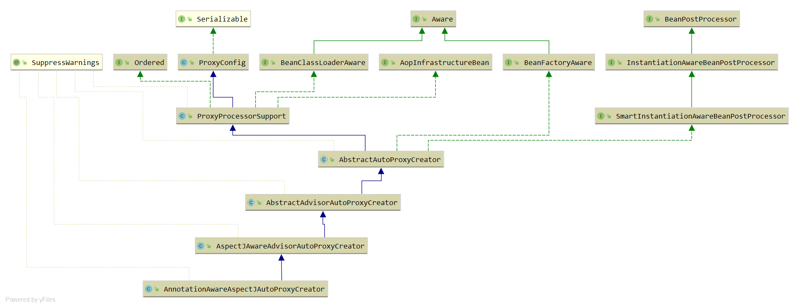

## AOP
---------------------

动态AOP
---------------------
1. 注册AnnotationAwareAspectJAutoProxyCreator
在配置类上使用@EnableAspectJAutoProxy，spring就支持注解的AOP。
```
	private static BeanDefinition registerOrEscalateApcAsRequired(
			Class<?> cls, BeanDefinitionRegistry registry, @Nullable Object source) {
		// 如果在 registry 已经存在自动代理创建器，并且传入的代理器类型与注册的不一致，根据优先级判断是否需要修改
		if (registry.containsBeanDefinition(AUTO_PROXY_CREATOR_BEAN_NAME)) {
			BeanDefinition apcDefinition = registry.getBeanDefinition(AUTO_PROXY_CREATOR_BEAN_NAME);
			if (!cls.getName().equals(apcDefinition.getBeanClassName())) {
				int currentPriority = findPriorityForClass(apcDefinition.getBeanClassName());
				int requiredPriority = findPriorityForClass(cls);
				if (currentPriority < requiredPriority) {
					//改变bean对应的className
					apcDefinition.setBeanClassName(cls.getName());
				}
			}
			//如果存在的与将要创建的一致，则无需再次创建
			return null;
		}

		RootBeanDefinition beanDefinition = new RootBeanDefinition(cls);
		beanDefinition.setSource(source);
		// 设置最高优先级
		beanDefinition.getPropertyValues().add("order", Ordered.HIGHEST_PRECEDENCE);
		beanDefinition.setRole(BeanDefinition.ROLE_INFRASTRUCTURE);
		registry.registerBeanDefinition(AUTO_PROXY_CREATOR_BEAN_NAME, beanDefinition);
		return beanDefinition;
	}
```

- proxy-target-class：选择使用代理类型，true为CGLIB，但无法代理final方法，不能被覆写。
- expose-proxy：为true对对象内部的自我调用增强，例如事务。a()调用this.b()，可写成((AService)AopContext.currentProxy()).b()，
即可对a和同时增强。
---------------------

创建AOP代理
---------------------
类的层次结构


AnnotationAwareAspectJAutoProxyCreator实现了BeanPostProcessor接口，当spring加载bean会在实例化前调用postProcessAfterInitialization
方法。


---------------------